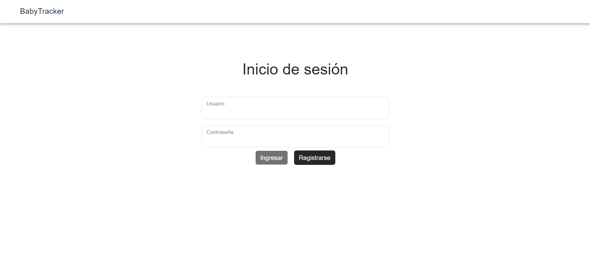
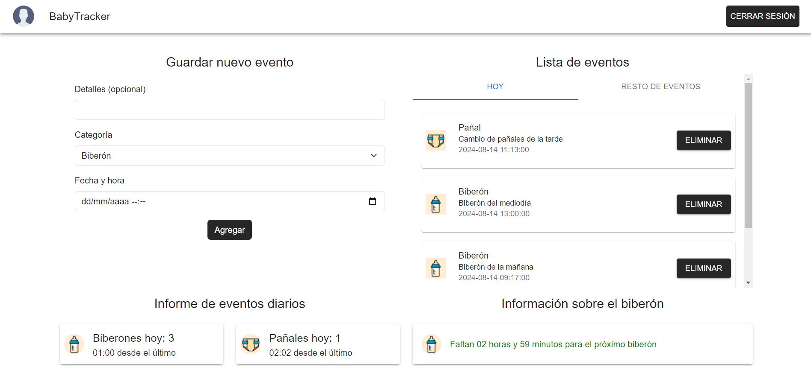
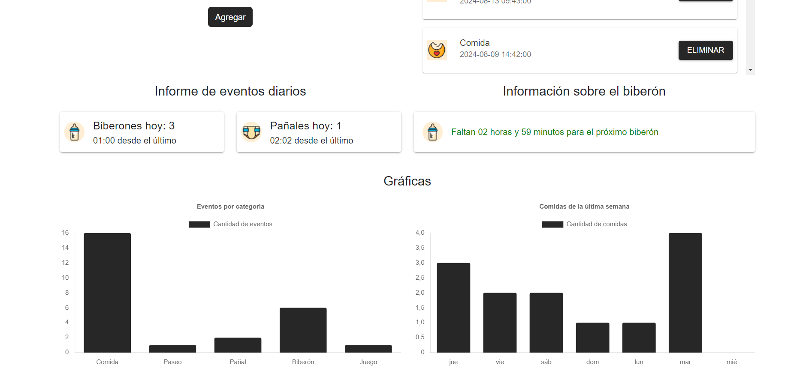

# BabyTracker

Aplicación desarrollada para el taller de desarrollo Front End de la Universidad ORT


## Screenshots






## Deployment

Para desplegar el proyecto ejecute:

```bash
  npm run build
```


## Tech Stack

**Cliente:** React, Redux, Mui, Emotion, ChartJS, Bootstrap


